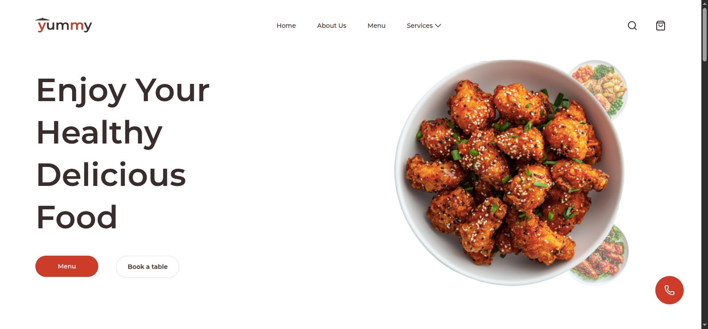
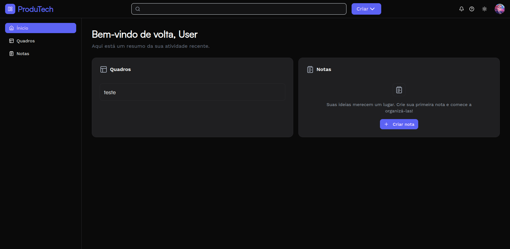

<h1 data-importer="text" align="center">Hi 👋, I'm Obede Dintala</h1>

###

<h3 data-importer="text" align="center">Frontend Developer passionate about building modern web applications.</h3>

###

Building scalable experiences with React, Next.js, NestJS and TypeScript.

###

  
  

###

###

<h1 data-importer="text" align="left">About me</h1>

###

I'm a Frontend Developer from Angola 🇦🇴 passionate about creating modern, responsive and user-friendly web applications.  I enjoy turning ideas into polished digital products while continuously improving my knowledge of software architecture and backend development.  - 💻 Building modern web applications with React, Next.js and TypeScript. - 🚀 Exploring backend development using NestJS, Express and PostgreSQL. - 🎨 Passionate about UI/UX, animations and clean code. - 🌱 Always learning new technologies and best practices. - 🤝 Open to collaborating on exciting projects.

###

 

###

<h1 data-importer="text" align="left">Skills</h1>

###

  
  
  
  
  
  
  
  
  
  
  
  
  
  
  
  
  
  
  
  
  
  
  
  
  
  
  
  
  
  
  
  
  
  
  
  
  
  
  
  
  

###

###

 

###

<h1 data-importer="text" align="left">Featured Projects</h1>

###

<h3 data-importer="text" align="left">1. Yummy Restaurant</h3>

###

  

###

<h4 data-importer="text" align="left">Description</h4>

###

Modern restaurant website with online reservations.

 

<h4 data-importer="text" align="left">Tech Stack</h4>

  
  
  
  
  
  
  
  
  
  
  
  
  

 

<h4 data-importer="text" align="left">Repository</h4>

https://github.com/obedeDintala123/yummy-restaurant

 

<h3 data-importer="text" align="left">2. ProduTech</h3>

###

  

###
<h4 data-importer="text" align="left">Description</h4>

###

Modern productivity platform.

###

 

<h4 data-importer="text" align="left">Tech Stack</h4>

###

  
  
  
  
  
  
  
  
  
  
  

###

 
<h4 data-importer="text" align="left">Repository</h4>

###

https://github.com/obedeDintala123/produTech

###

 
<h1 data-importer="text" align="left">Current Focus</h1>

###

- Building modern SaaS applications. - Improving UI/UX and animations with GSAP. - Learning scalable backend architecture using NestJS. -  Exploring Docker and CI/CD workflows.

###

###

###

<h1 data-importer="text" align="left">Goals for 2026</h1>

###

- Build production-ready SaaS applications. - Contribute to Open Source. - Publish my first npm package. - Improve backend architecture skills. - Master Docker and DevOps fundamentals.

###

<picture>
  <source
    media="(prefers-color-scheme: dark)"
    srcset="https://raw.githubusercontent.com/obedeDintala123/obedeDintala123/pacman-output/pacman-contribution-graph-dark.svg"
  />
  <source
    media="(prefers-color-scheme: light)"
    srcset="https://raw.githubusercontent.com/obedeDintala123/obedeDintala123/pacman-output/pacman-contribution-graph.svg"
  />
  
</picture>

###
